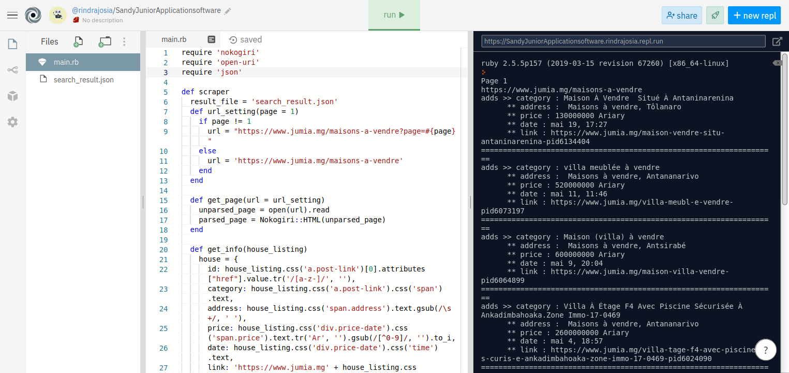
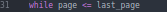

# Web Scraping with Ruby and Nokogiri

In this project, I build my own scraper. The main goal is to scrape information from https://www.jumia.mg/maisons-a-vendre&xhr=9jdcu and to store data in a json file.



## Web Scraping with Ruby and Nokogiri

- Web scraping: is a programmatic method of extracting data from websites. When you browse the web you consume a ton of publicly available information.  As a user, all of this information is presented to you as unstructured data in the form of HTML documents.  Now imagine, what if you could take all of these pages of  and turn them into structured data, pick out the pieces you like and export it all to a database or spreadsheet.
There are many ways to scrape data from websites but in this project I have built my own sraper.

## Getting Started

You can get a local copy of the repository please run the following commands on your terminal:

```
$ cd <folder>

$ git clone https://github.com/rindrajosia/capstone-scraper.git
```
### To limit the numbers of page scraped:
*  Go to the bin folder and open the main file then change "last_page" with the number of the page that you want to scrape:




## To run the program:
### Step 1 - Install dependencies:
- In your terminal go to the folder you have saved the repository and type:
* bundle install
### Step 2 - then go to bin folder and type: ruby main

## To check information result:
* Go to '/tmp/search_result.json'

## Testing with RSpec:
* To test it you should go to your terminal on the folder you saved and type: rspec

## Built With

- Ruby
- Nokogiri
- Rspec

## Live Demo

[Live Demo Link](https://a2cc795e-accb-4398-b1bd-a286fc3c4551.ws-eu01.gitpod.io/#/workspace/capstone-scraper)

## Authors

👤 **Rindra Josia**

* Github: **[@rindrajosia](https://github.com/rindrajosia)**
* Twitter: **[@rindrajosia](https://twitter.com/josia_rindra)**
* Linkedin: **[linkedin](https://www.linkedin.com/in/rindrajosia/)**

## 🤝 Contributing

Contributions, issues and feature requests are welcome!

Feel free to check the [issues page](https://github.com/rindrajosia/capstone-scraper/issues).

## Show your support

Give a ⭐️ if you like this project!

## Acknowledgments

 - Project from Microverse
 - Originally taken from The Odin Project
